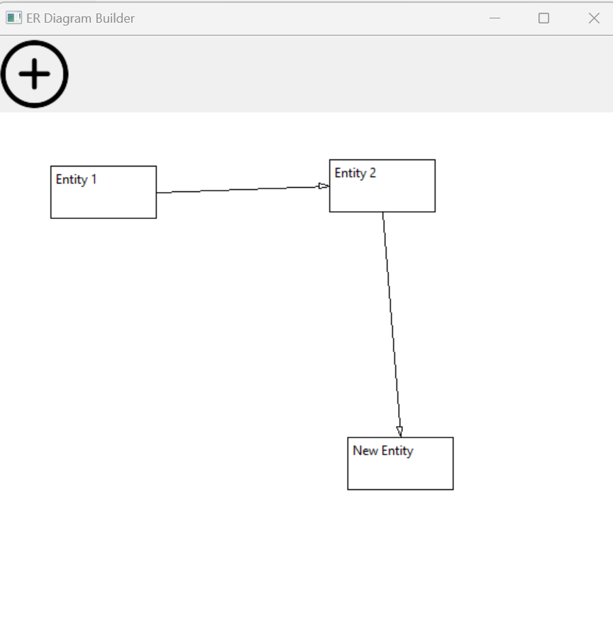

# ER-Diagram-Builder
Create RPD using wxPython

### Windows Installation:
1. Download miniconda: https://docs.anaconda.com/free/miniconda/
2. Opend miniconda shell.
3. Create env: ```conda create -n py37 python=3.7.13```
4. Activate new env: ```conda activate py37```
5. Install requirements ```conda install --yes --file requirements.txt```
6. Done: ```python .\test.py```
   




YouTube: https://www.youtube.com/watch?v=TdXTu1l2Rz0
Medium: https://medium.com/@alexbuzunov/tiny-wxpython-demo-er-diagramming-761f53fef91d

